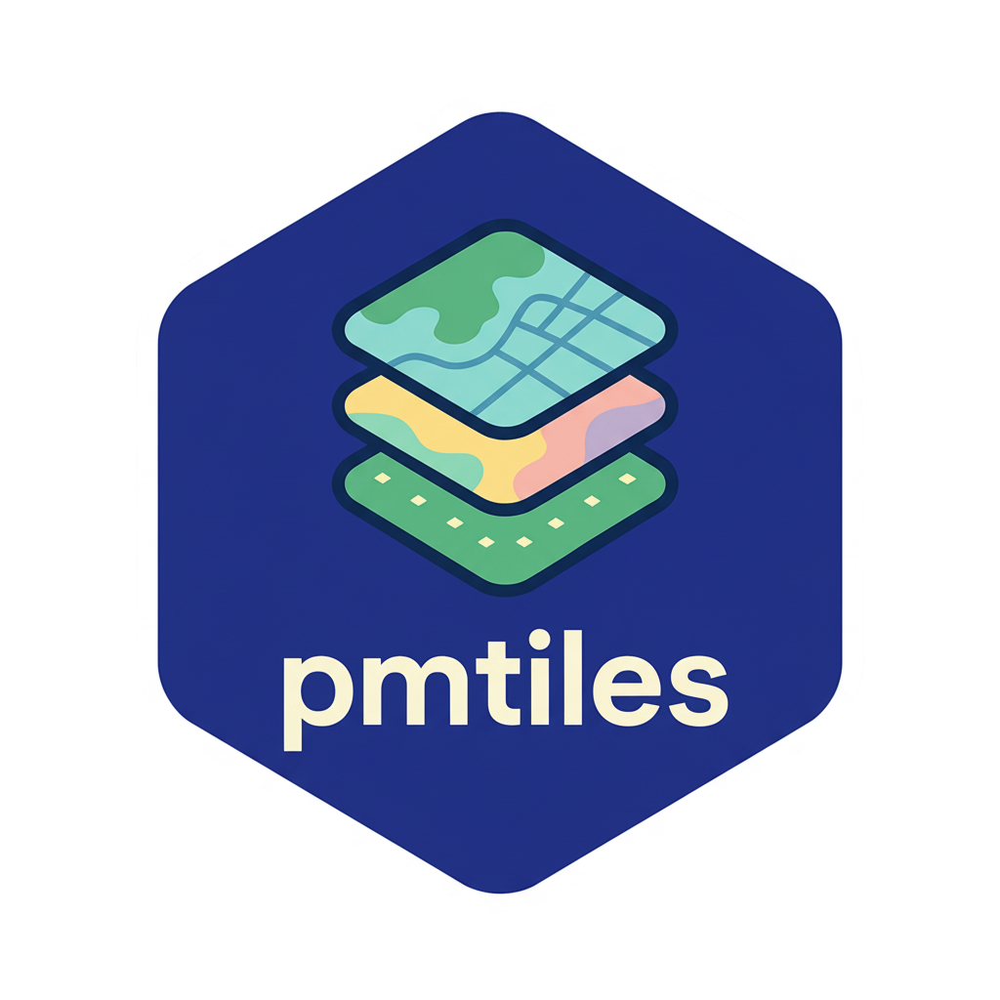

# pmtiles 

> R wrapper for the [pmtiles](https://github.com/protomaps/go-pmtiles) command-line tool

PMTiles is a single-file archive format for tiled map data. This package provides R functions to work with PMTiles archives, including creating, inspecting, converting, and serving them for visualization.

## Installation

Install from GitHub:

```r
# Using pak (recommended)
pak::pak("walkerke/pmtiles")

# Or using remotes
remotes::install_github("walkerke/pmtiles")
```

The package includes pre-compiled PMTiles binaries for:
- macOS (Intel and Apple Silicon)
- Linux (x86_64 and ARM64)
- Windows (x86_64 and ARM64)

No additional dependencies required!

## Quick Start

### Inspect a PMTiles archive

```r
library(pmtiles)

# Show basic info
pm_show("path/to/file.pmtiles")

# Get metadata as JSON
metadata <- pm_show("path/to/file.pmtiles", metadata = TRUE)

# Get TileJSON
tilejson <- pm_show("path/to/file.pmtiles", tilejson = TRUE)
```

### Quick visualization

The fastest way to visualize PMTiles (requires the [mapgl](https://walker-data.com/mapgl) package):

```r
# Visualize local file
pm_view("path/to/file.pmtiles")

# Visualize remote file
pm_view("https://example.com/tiles.pmtiles")

# Customize the map
pm_view(
  "path/to/file.pmtiles",
  layer_type = "fill",
  fill_color = "#088",
  fill_opacity = 0.7,
  inspect_features = TRUE  # Enable hover tooltips
)
```

`pm_view()` automatically:
- Detects geometry type (polygons, lines, or points)
- Starts a local server for local files
- Sets appropriate zoom levels based on tile availability
- Adds interactive hover effects and tooltips

### Serve PMTiles locally

#### Two approaches to serving PMTiles

**pm_serve()** - Serves raw .pmtiles files for PMTiles.js clients

```r
pm_serve("file.pmtiles", port = 8080)

# Simple usage with mapgl's PMTiles protocol
library(mapgl)
mapboxgl() |>
  add_pmtiles_source(
    id = "tiles",
    url = "http://localhost:8080/file.pmtiles"
  ) |>
  add_fill_layer(
    id = "layer",
    source = "tiles",
    source_layer = "layer_name"
  )

# Or use with pm_view() for quick visualization
pm_view("http://localhost:8080/file.pmtiles")

# Stop the server when done
pm_stop_server(port = 8080)
```

**pm_serve_zxy()** - Serves Z/X/Y tile endpoints

```r
pm_serve_zxy("~/pmtiles/directory")

# Use with standard tile URLs
mapboxgl() |>
  add_vector_source(
    id = "tiles",
    tiles = "http://localhost:8080/file/{z}/{x}/{y}.mvt"
  ) |>
  add_fill_layer(
    id = "layer",
    source = "tiles",
    source_layer = "layer_name"
  )

# Serve from cloud storage without downloading
pm_serve_zxy(
  bucket = "s3://my-bucket?endpoint=https://account.r2.cloudflarestorage.com&region=auto",
  public_url = "http://localhost:8080"
)

# Run in background
server <- pm_serve_zxy(background = TRUE)
pm_stop_server(server)
```

#### When to use each approach

**Use `pm_serve()`:**
- Quick local preview with `pm_view()`
- Simpler setup with PMTiles protocol
- Files up to ~1GB typically work well

**Use `pm_serve_zxy()`:**
- Large files (multi-GB) that need reliable serving
- Serving from cloud storage (S3/R2) without downloading
- Compatibility with non-PMTiles.js clients

**For very large files locally:**
Both approaches may have limitations. Consider:
- Using `pm_serve_zxy()` which handles large files more reliably
- Using Node's http-server: `http-server -p 8080 --cors` with `pm_view()`
- Uploading to cloud storage and serving remotely

```r
# Example with Node's http-server
pm_view("http://localhost:8080/YOUR_TILES.pmtiles", inspect_features = TRUE)
```

## Main Functions

### Inspection & Info
- `pm_show()` - Display archive information and metadata
- `pm_verify()` - Verify archive integrity
- `pm_tile()` - Extract a single tile

### Creation & Conversion
- `pm_create()` - Create PMTiles from GeoJSON/sf with tippecanoe
- `pm_convert()` - Convert MBTiles to/from PMTiles
- `pm_extract()` - Extract a region or zoom levels
- `pm_cluster()` - Cluster tiles for cloud upload
- `pm_upload()` - Upload to S3/R2/GCS

### Editing
- `pm_edit()` - Modify archive metadata

### Serving & Visualization
- `pm_serve()` - Start local HTTP server with CORS (serves raw .pmtiles files)
- `pm_serve_zxy()` - Serve Z/X/Y tile endpoints (works with any map client)
- `pm_view()` - Quick interactive visualization
- `pm_stop_server()` - Stop any running PMTiles server (by port or server object)

### Utilities
- `pm_version()` - Show PMTiles CLI version

## Examples

### Convert MBTiles to PMTiles

```r
pm_convert(
  input = "data.mbtiles",
  output = "data.pmtiles"
)
```

### Extract a region

```r
pm_extract(
  input = "world.pmtiles",
  output = "usa.pmtiles",
  bbox = c(-125, 24, -66, 49),  # [west, south, east, north]
  maxzoom = 10
)
```

### Update metadata

```r
pm_edit(
  input = "file.pmtiles",
  attribution = "© OpenStreetMap contributors",
  description = "Street map of Austin, TX"
)
```

### Upload to cloud storage

```r
# Upload to Cloudflare R2
pm_upload(
  input = "data.pmtiles",
  bucket = "s3://my-bucket?endpoint=https://account.r2.cloudflarestorage.com"
)
```

## Working with Remote PMTiles

Many functions support remote URLs:

```r
# Inspect remote archive
pm_show("https://example.com/tiles.pmtiles", metadata = TRUE)

# Extract from remote source
pm_extract(
  input = "https://example.com/world.pmtiles",
  output = "local-region.pmtiles",
  bbox = c(-98, 30, -97, 31)
)

# Visualize remote tiles
pm_view("https://example.com/tiles.pmtiles")
```

## Creating PMTiles

### With tippecanoe (Recommended)

The `pm_create()` function provides a comprehensive R wrapper for tippecanoe, allowing you to create PMTiles directly from sf objects or GeoJSON files.

**Note**: You must install tippecanoe separately:
- macOS: `brew install tippecanoe`
- Ubuntu (from source):

```
git clone https://github.com/felt/tippecanoe.git
cd tippecanoe
make -j
make install
```

Unfortunately, this workflow is not supported for Windows users.

```r
library(sf)
library(pmtiles)

# Simple: Create from sf object
my_data <- st_read("data.geojson")
pm_create(my_data, "output.pmtiles", max_zoom = 14)

# Advanced: High-quality parcel tiles
pm_create(
  "parcels.geojson",
  "parcels.pmtiles",
  layer_name = "parcels",
  min_zoom = 10,
  max_zoom = 18,
  full_detail = 15,
  preserve_input_order = TRUE,
  no_tiny_polygon_reduction = TRUE,
  coalesce_densest_as_needed = TRUE,
  coalesce_fraction_as_needed = TRUE,
  simplification = 1,
  detect_shared_borders = TRUE,
  other_options = c("-pf", "-pk", "-ai")
)

# Point clustering for markers
pm_create(
  points_sf,
  "clustered_points.pmtiles",
  max_zoom = 14,
  cluster_distance = 10,
  cluster_maxzoom = "g",
  generate_ids = TRUE
)

# With attribute filtering
pm_create(
  roads_sf,
  "roads.pmtiles",
  include = c("name", "highway", "surface"),
  drop_densest_as_needed = TRUE,
  simplification = 10
)
```

### Other Tools

- [go-pmtiles](https://github.com/protomaps/go-pmtiles) CLI - Use `pm_convert()` to convert from MBTiles
- [planetiler](https://github.com/onthegomap/planetiler) - Create from OSM data

## Requirements

- R >= 4.0
- For `pm_view()` and `pm_serve()`: [mapgl](https://walker-data.com/mapgl) package

## License

- R package code: MIT License
- Embedded go-pmtiles binaries: BSD-3-Clause License (see `inst/COPYRIGHTS`)

## Related Projects

- [go-pmtiles](https://github.com/protomaps/go-pmtiles) - The underlying CLI tool
- [PMTiles specification](https://github.com/protomaps/PMTiles)
- [mapgl](https://walker-data.com/mapgl) - R interface to MapLibre GL JS

## Credits

This package wraps the [go-pmtiles](https://github.com/protomaps/go-pmtiles) command-line tool by Protomaps.
